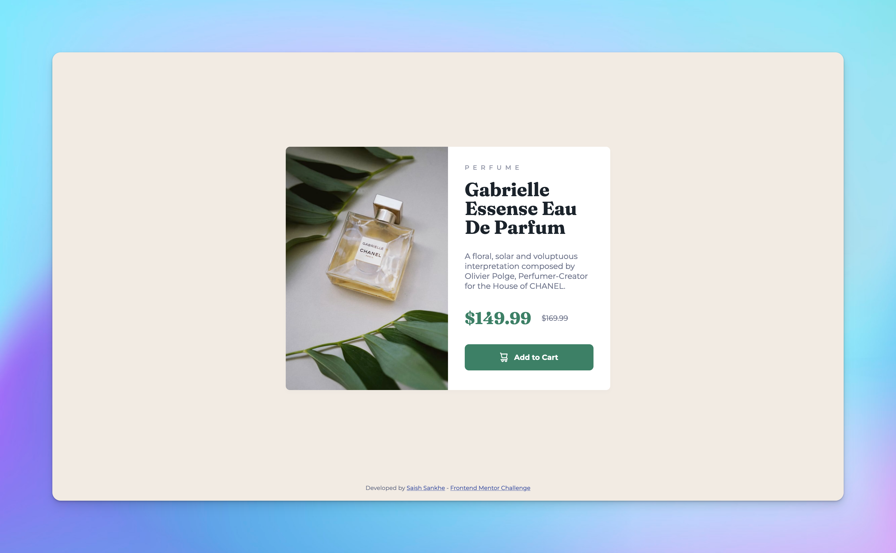

# Frontend Mentor - Product preview card component solution

This is my solution to the [Product preview card component challenge on Frontend Mentor](https://www.frontendmentor.io/challenges/product-preview-card-component-GO7UmttRfa). 

## Table of contents

- [Overview](#overview)
  - [The challenge](#the-challenge)
  - [Screenshots](#screenshots)
  - [Links](#links)
  - [My process](#my-process)
  - [Built with](#built-with)

## Overview

### The challenge

Users should be able to:

- View the optimal layout depending on their device's screen size
- See hover and focus states for interactive elements

### Screenshots

  

### Links

- Solution URL: [Github](https://github.com/SaishSankhe/Product-preview-card-Frontend-Mentor)
- Live Site URL: [Vercel](https://product-preview-card-frontend-mentor-clz4u8dwx-saishsankhe.vercel.app/)

## My process
I started with creating the layout in HTML using flexbox. When the basic layout was done, I applied the CSS for desktop and then added mobile as well.

### Built with

- Semantic HTML5 markup
- CSS custom properties
- Flexbox
